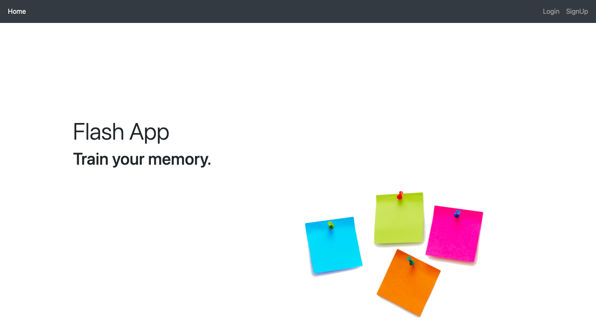
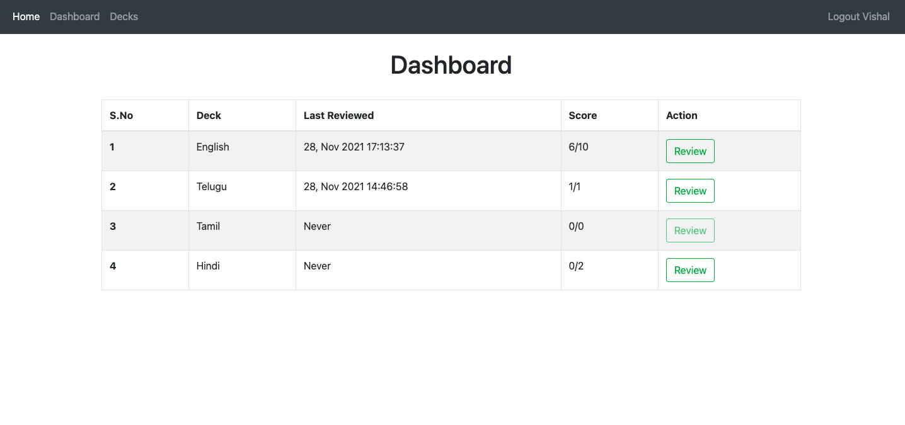
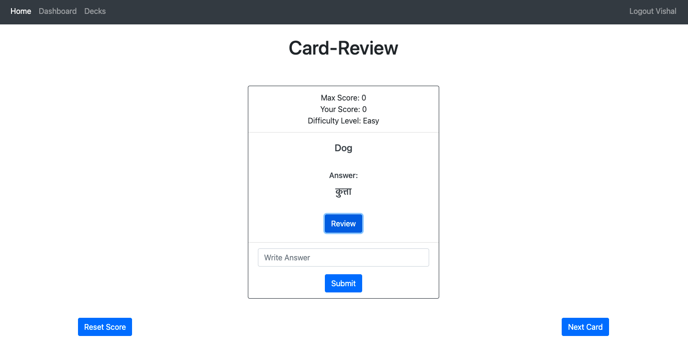

# Flash Cards Web App

This is a web-app which can be used for memory-training by using the concept of Flash Cards.

It uses:
- Python 3
- Flask
- SQLite

---

## Features

- Signup and login feature
- Create and edit Decks containing Flash Cards
- Reset the score of a Flash Card to use it again
- Classify cards as per difficulty level
- The App will automatically ask a difficult question if an easier question has been answered successfully

---

## Screenshots

Home



---

Dashboard for tracking progress



---

Flash Card Review



---

## Setup & Installation

Make sure you have the latest version of Python installed.

```bash
pip install -r requirements.txt
```

Setup the below environment-variables.

- FLASK_APP = main.py
- FLASK_ENV = development
- FLASK_DEBUG = 1

### Running The App

```bash
python -m flask run
```

### Viewing The App

Go to `http://127.0.0.1:5000`